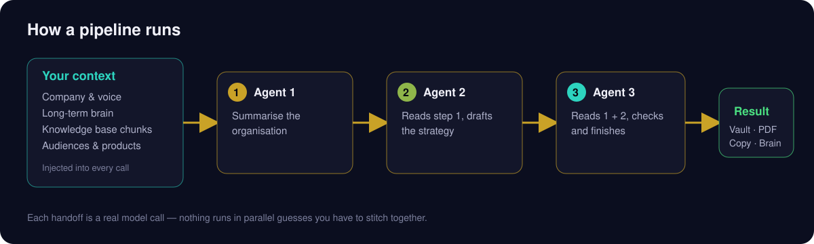
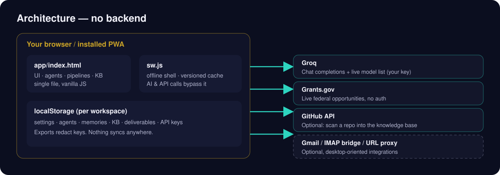

<p align="center"></p>

# ForceIQ — AI Workforce Suite

A local-first AI workforce that runs in your browser and installs on your phone. You bring a free Groq key; ForceIQ brings the agents, pipelines, grant discovery, social engine and outreach builder. Every output is grounded in your organization's own context and voice.

## What it is

Most AI tools give you a chat box. ForceIQ gives you a configured crew. Describe your company once (mission, voice, audiences, products) and every agent reads that context before it writes. Agents run in sequence, and each one reads what the last produced.



- **Pipelines** — Grant Readiness, Brand Content Batch, Outreach Strategy, Weekly Review, App Launch Prep, Business Plan, or build your own.
- **Live grant discovery** — queries the real Grants.gov API. Real links, no invented deadlines.
- **Social engine** — one update becomes a tailored post per platform.
- **Outreach builder** — pick an audience and a goal; get subject, body and call to action in your voice.
- **Knowledge base** — URLs, pasted text, files, or a GitHub repo. Relevant passages are scored and injected into prompts.
- **Long-term brain** — standing rules every agent follows.
- **Multi-workspace** — separate settings, agents, memory and KB per company.
- **Mail hub** — optional Gmail OAuth or a local IMAP bridge (desktop-oriented).
- **JVox sample** — one tap loads a fully configured example workspace so you can see how it works.

## Live URLs

| | |
|---|---|
| Landing | https://johnlaz.github.io/forceiq/ |
| App | https://johnlaz.github.io/forceiq/app/ |

## Repo layout

```
/index.html            landing page
/README.md
/docs/                 README SVGs (banner, how-it-works, architecture)
/app/index.html        the app (single file)
/app/manifest.json
/app/sw.js
/app/icon-192.png
/app/icon-512.png
/app/shot-narrow-1.png, shot-narrow-2.png, shot-wide.png
```

## AI & model setup

1. Get a free key at [console.groq.com](https://console.groq.com).
2. Open **Settings → API Keys**, paste it, and press **Save Keys**.
3. ForceIQ fetches Groq's current chat-model list automatically. Press **↻ Refresh** any time.

The default model is `llama-3.3-70b-versatile`. Your selection is never changed automatically — if a saved model disappears from Groq's list, it is kept and flagged. Groq is the only AI provider.

Usage is modest: a typical three-step pipeline is a few thousand tokens. Check your Groq console for your current free-tier limits.

## Data & privacy



- All workspace data lives in your browser's `localStorage`, scoped per workspace.
- Network calls go only to services you trigger: Groq, Grants.gov, GitHub, and optionally Gmail. URL indexing uses the public `allorigins.win` relay, so the URLs you index pass through it.
- API keys are stored locally and sent only to their own API. Exports redact them.
- No analytics, telemetry or tracking.
- `localStorage` is limited to a few MB; use **Export State** regularly. The app warns if storage fills.

## Deploy / update

Host the repo root on GitHub Pages. The app lives at `/app/`, so its scope is `/forceiq/app/`.

When you ship a change:

1. Bump `APP_VERSION` in `app/index.html` **and** `VERSION` in `app/sw.js` to the same value.
2. Commit and push. Installed copies fetch the new HTML on next launch (network-first) and show an "Update installed — reload" notice.

The version in the sidebar footer should match the cache name `forceiq-v<VERSION>`.

## Changelog

**v8.1**
- Repo restructured: landing at root, app in `/app`, manifest, service worker and icons added (installable PWA).
- Mobile layout: slide-over menu, bottom tab bar, sheet-style dialogs, safe-area support, 16px inputs.
- Groq model picker with fetch-on-key-save and Refresh; default and saved selections preserved.
- Gemini integration removed (it was never used by any feature).
- Knowledge-base retrieval now scores passages (rarity-weighted, title and tag boosts) instead of plain substring match.
- Higher output limits per call; clearer rate-limit and bad-key messages.
- Quick-action tiles on the War Room; JVox sample workspace.
- Accessibility: keyboard-operable navigation, dialog roles, Escape to close, focus rings, reduced-motion support.
- Safety: workspace and brief text escaped; storage-full warning.
- Generic copy and funding starting points (no organization-specific defaults).

**v8.0** and earlier — see git history.

---

© 2026 LAZLAB Creations. All Rights Reserved. · lazlab.io@gmail.com
